# W365_Cpc_EntraOnboarding

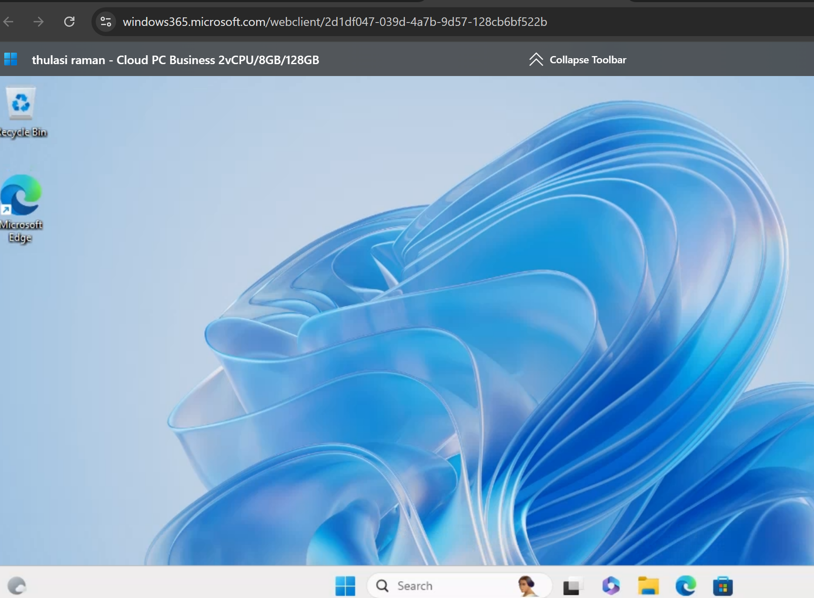

# what is windows 365

Windows 365 is like having a personal computer in the cloud. Instead of needing a physical computer to store all your files and apps, you can access your "virtual PC" from anywhere using the internet. Imagine your desktop, files, and programs following you wherever you go, so you can use them on any device, like a laptop, tablet, or even your phone

Windows 365 is a service that provides **Cloud PCs**—fully virtualized Windows desktops hosted in Azure. It allows users to:
- Access a Windows 10/11 desktop environment from anywhere.
- Run Microsoft 365 apps and other software in a consistent environment.
- Leverage the power of cloud computing for performance and scalability.

Both Windows 365 and Azure Virtual Desktop (AVD) let you access a virtual computer in the cloud, but they work differently:

Windows 365 is like renting your own personal computer in the cloud. It’s simple, always ready, and doesn’t need much setup. It’s great for people who just want a straightforward, predictable experience.

Azure Virtual Desktop (AVD) is more like renting a big office computer system where multiple people can share resources. It’s flexible and powerful but needs a lot more setup and management, making it better for businesses with IT teams.

**Windows 365** and **Azure Virtual Desktop (AVD)** are both virtualization solutions provided by Microsoft, but they cater to different use cases:

| Feature               | Windows 365                                | Azure Virtual Desktop (AVD)                      |
|-----------------------|--------------------------------------------|-------------------------------------------------|
| **Purpose**           | Designed for simplicity and predictability, offering dedicated Cloud PCs. | Provides flexible and scalable virtualization for shared and multi-user environments. |
| **Management**        | Fully managed by Microsoft with minimal IT overhead. | Requires IT expertise to manage infrastructure, scaling, and policies. |
| **User Experience**   | Each user gets their own dedicated Cloud PC. | Supports both personal desktops and pooled resources for multiple users. |
| **Infrastructure**    | Pre-configured, predictable pricing, and resources allocated per user. | Customizable with pay-as-you-go pricing based on consumption. |
| **Use Case**          | Best for businesses needing a simple, fixed-cost, always-on desktop. | Ideal for organizations requiring flexible setups for remote work, app virtualization, or multi-session environments. |
| **Setup Complexity**  | Minimal setup; essentially plug-and-play. | Requires configuration of Azure infrastructure, session hosts, and scaling. |
| **Cost Model**        | Fixed monthly pricing.                     | Consumption-based pricing, scaling costs with usage. |

Users can access their Windows 365 Cloud PC from virtually anywhere and on any device that supports the required access methods. Here's how they can access it:

### **Access Methods:**
1. **Web Browser**: 
   - Users can sign in to their **Windows 365 Cloud PC** via the **Windows 365 portal** (https://windows365.microsoft.com) using their Microsoft 365 account.
   - Once logged in, they can launch their Cloud PC directly from the browser.

2. **Remote Desktop Application (RDP)**:
   - Users can download and use the **Microsoft Remote Desktop** app (available for Windows, macOS, iOS, and Android).
   - After setting up the app with their Microsoft 365 credentials, users can connect to their virtual Windows desktop.

3. **Other Devices**:
   - Windows 365 is designed to be accessible from **Windows PCs**, **macOS**, **iOS**, and **Android** devices, providing flexibility in how users access their virtual desktop.

# what is microsoft graph

**Microsoft Graph** is a REST API that provides access to a wide range of resources in the **Microsoft cloud**. It allows developers to interact with the data in **Microsoft 365**, **Azure Active Directory (Azure AD)**, **Windows 10**, and other Microsoft services. The Graph API enables applications to read and write to various Microsoft services, and it uses **OAuth 2.0** for secure access and authentication.

Key features of Microsoft Graph include:
- **Access to Azure Active Directory (Azure AD)**: Users, groups, organizational data.
- **Microsoft 365 Data**: Emails, calendar events, files, SharePoint lists, etc.
- **Intune and Device Management**: Manage devices and applications.
- **Windows 10 Data**: System and user-related data from Windows 10 devices.

# demo

`Install-Module -Name Microsoft.Graph -Scope CurrentUser`

using powershell to install graph modules

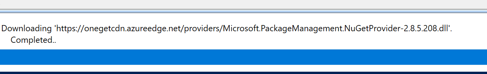
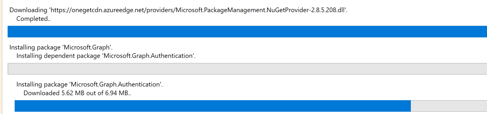

connect to graph

` Connect-MgGraph -Scopes "User.ReadWrite.All", "Group.ReadWrite.All","Directory.Read.All" `
This creates an app registration in the Entra with the necessary API permissions granted

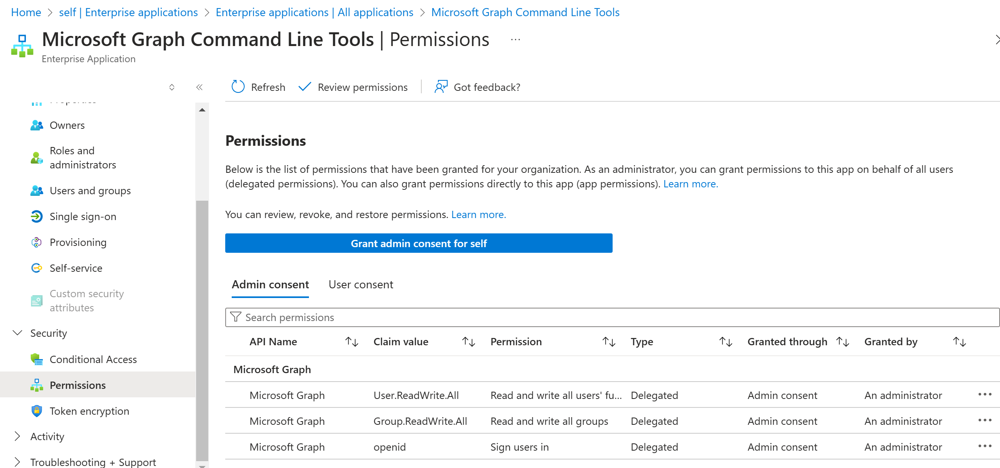

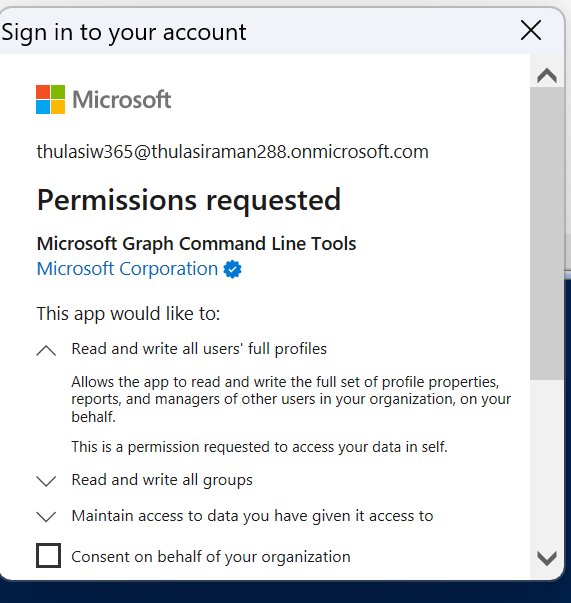

Verify the context

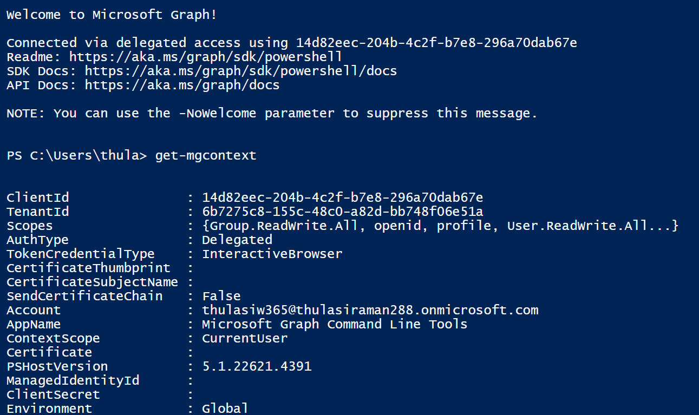

if no license available to assign, notify the admin

else,

create the user

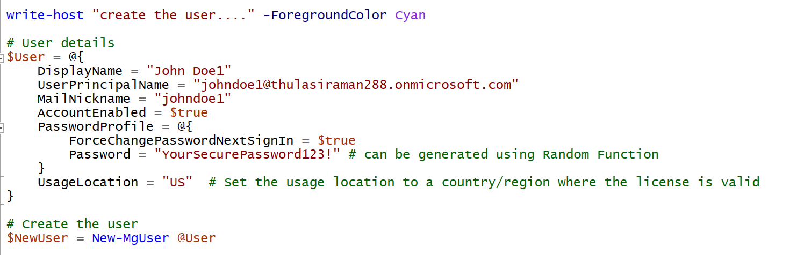
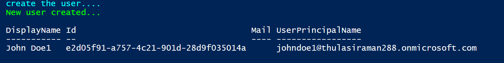

and assign the license

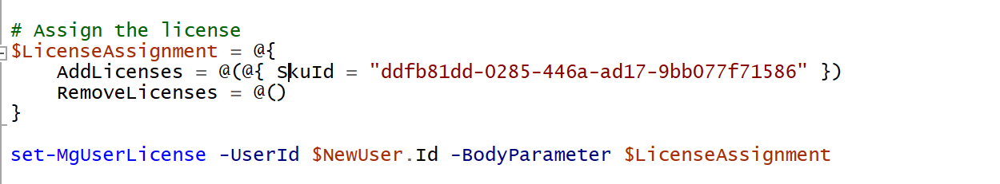

Functional Script

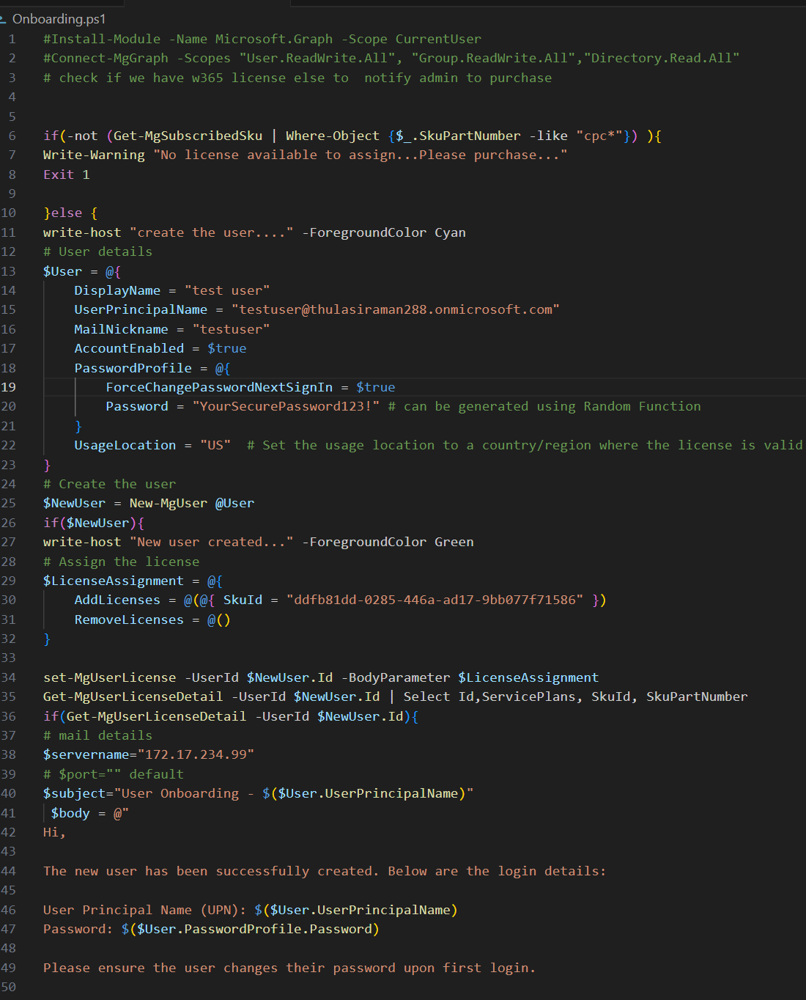

Verify in portal

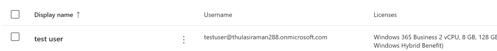

optional to setup the mail transfer agent

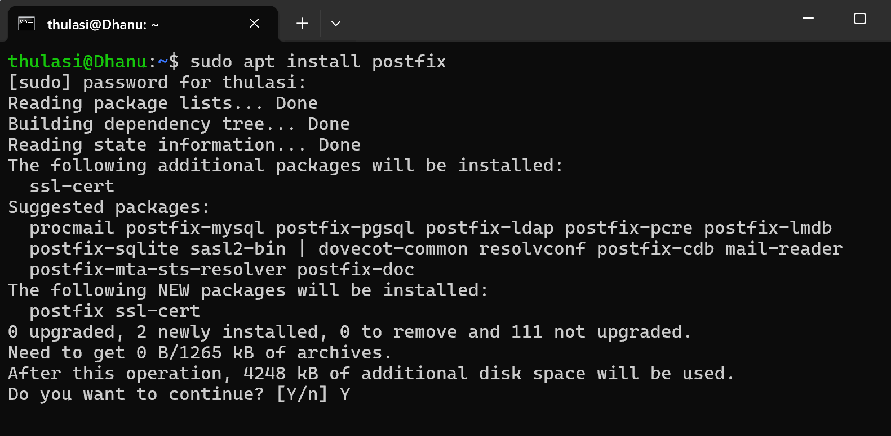

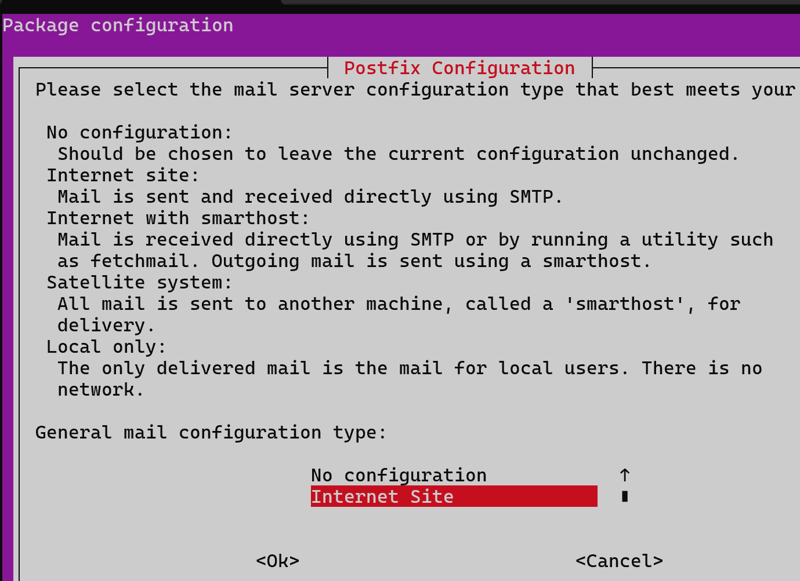

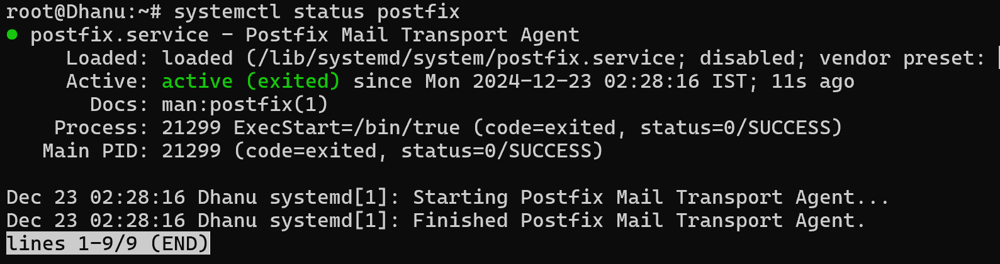

get the hostname, ip, and the os details

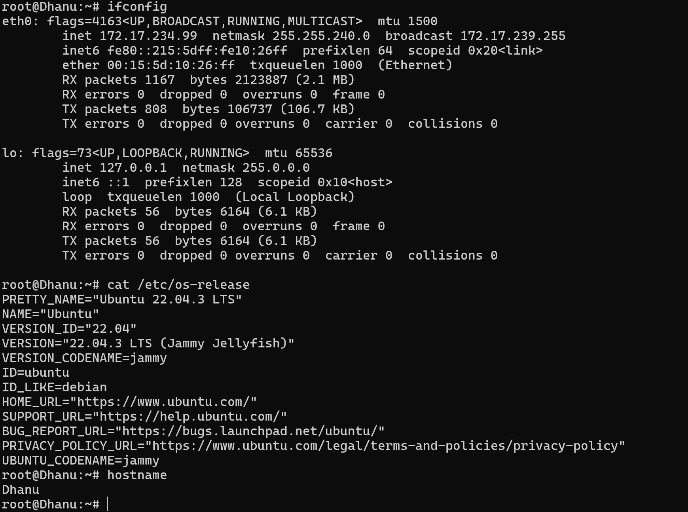

install mailutils - utility to send mail from local server
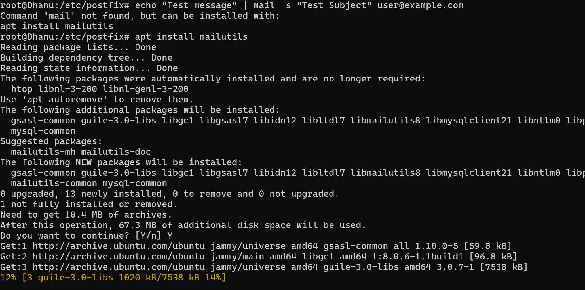

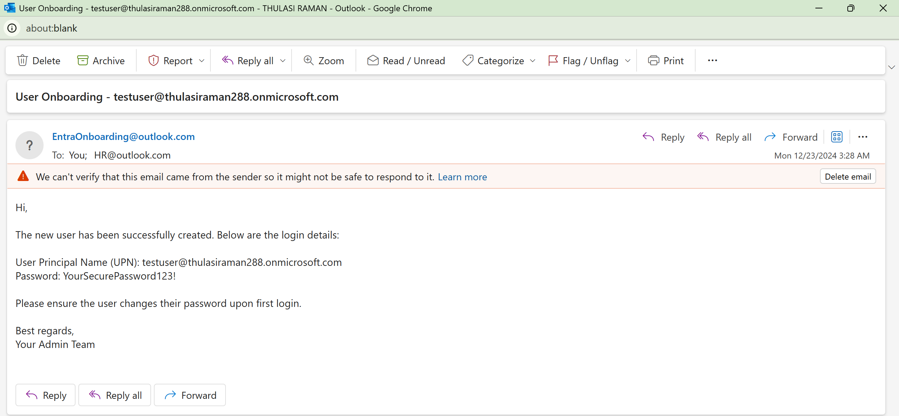

Also the postfix logs to see the email delivery

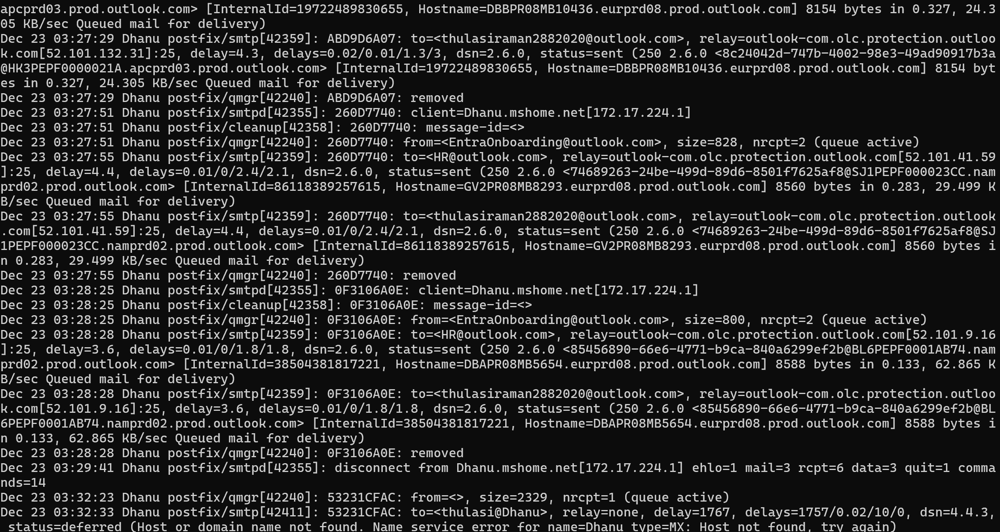

Test the W365 Access

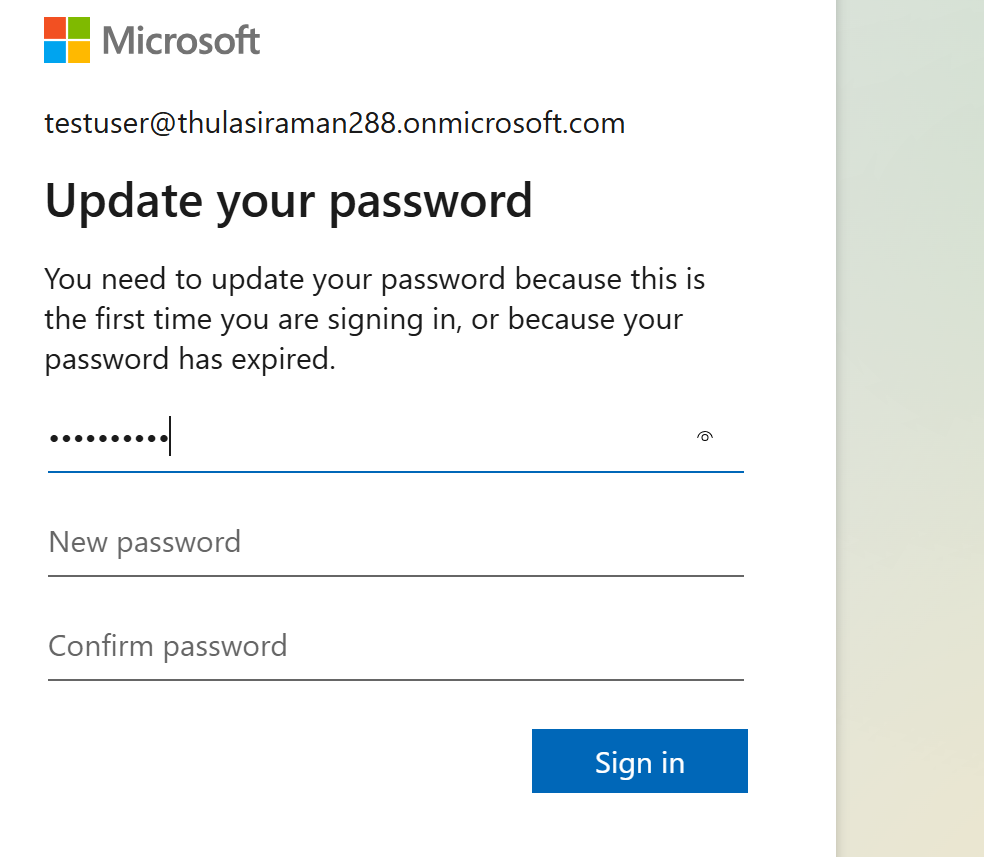

Asking to reset the password at first login

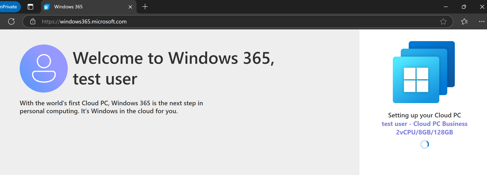

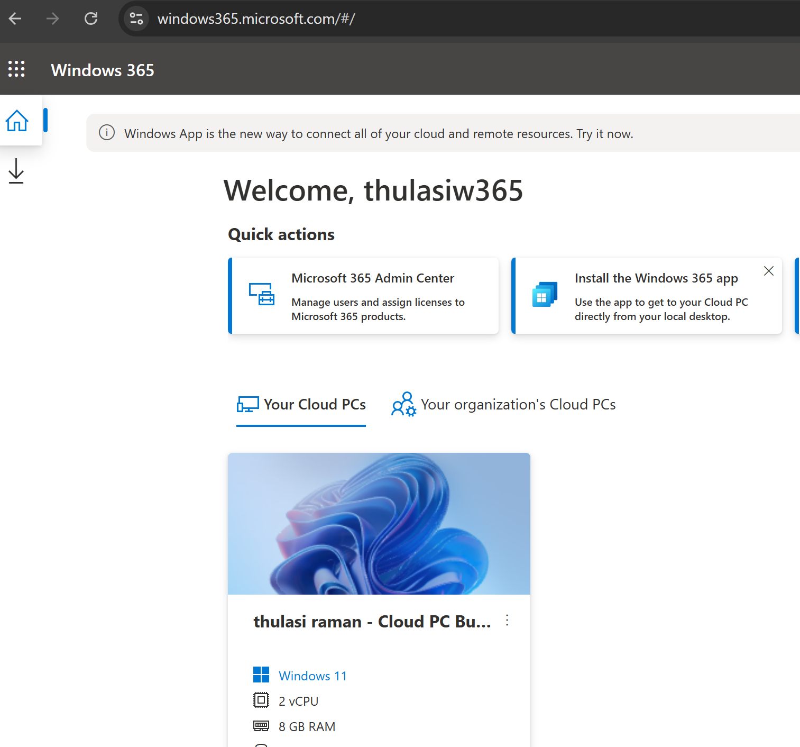

Also, as an admin, we can configure the Cloud PC - settings

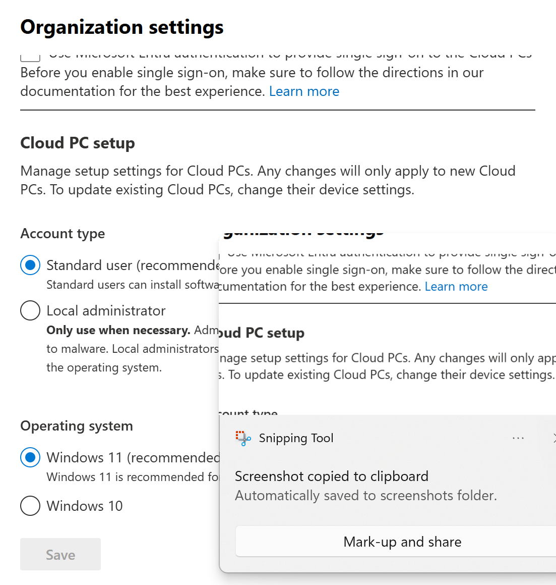

or to manage it from intune and apply the configuration profiles / Apps / updates

